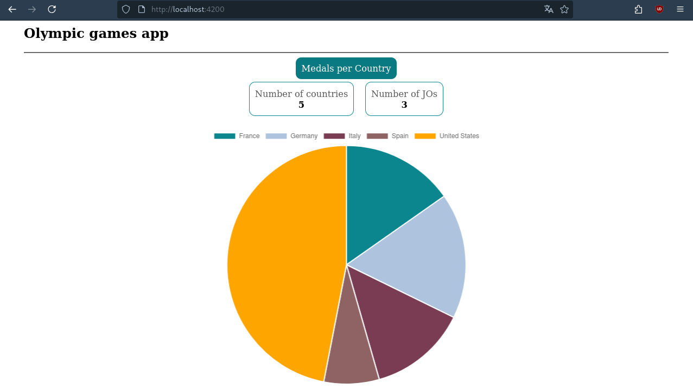
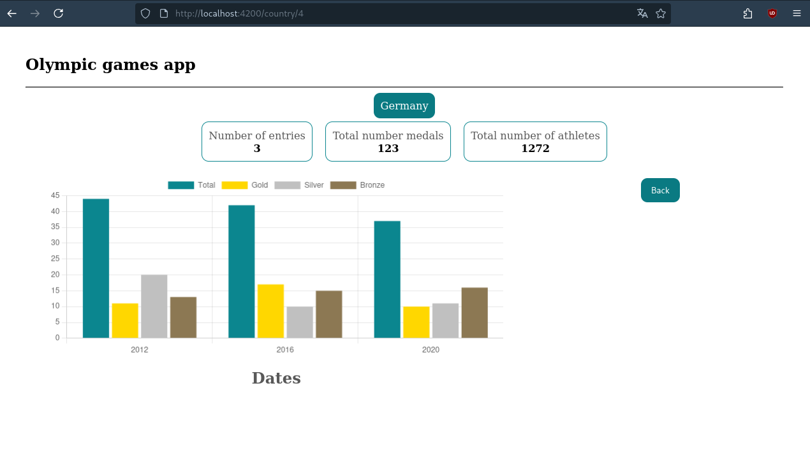
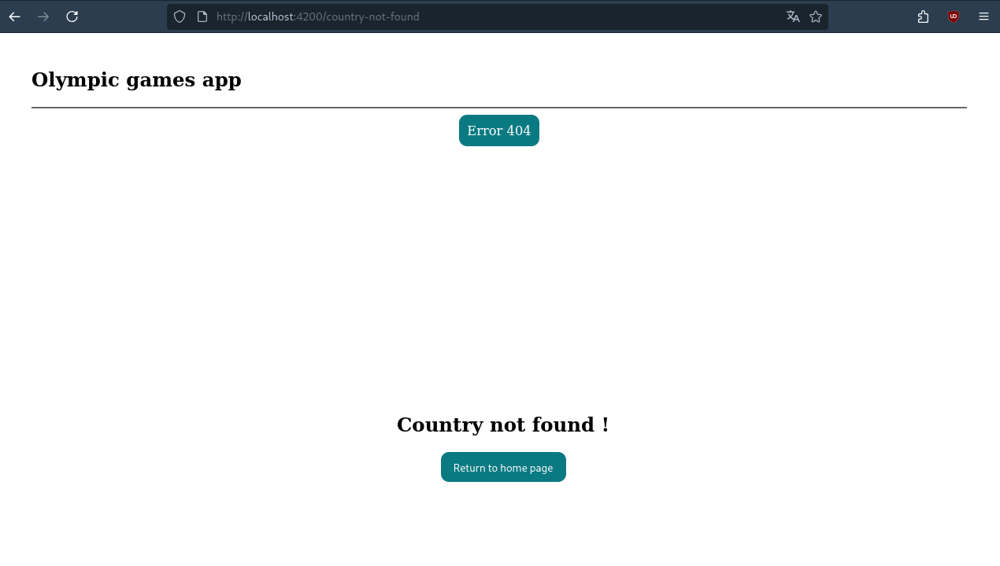
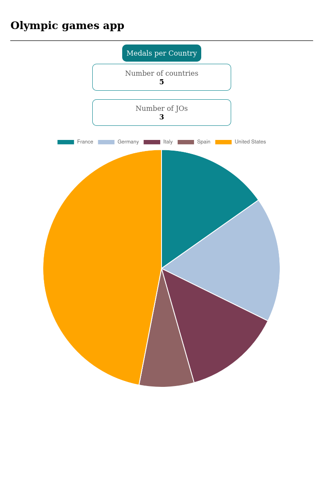
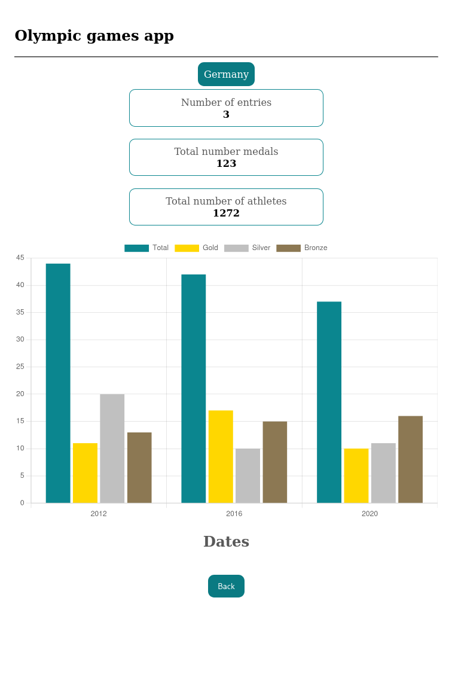
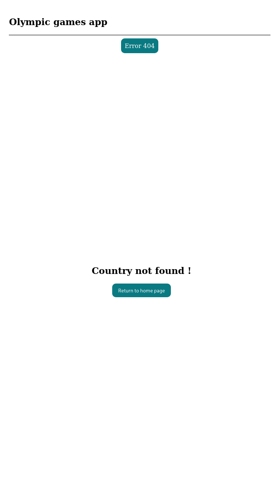
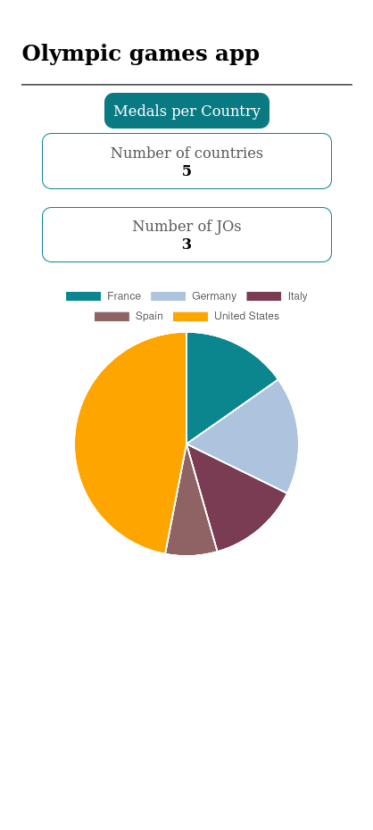
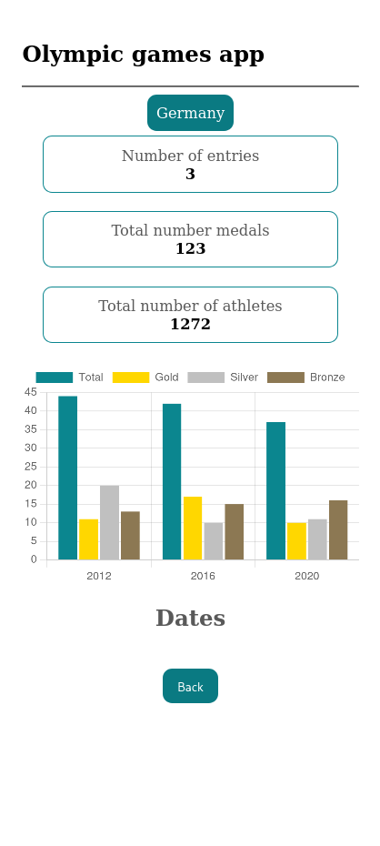

# Table of content
1. [OlympicGamesStarter](#olympicgamesstarter)  
    1.1 [Requirements](#requirements)  
    1.2 [Development server](#development-server)  
    1.3 [Build](#build)  
2. [Architecture](#architecture)  
3. [Pages](#pages)  
    3.1 [Descriptions](#descriptions)  
    3.2 [Screenshots](#screenshots)

# OlympicGamesStarter

Angular 18 single-page application displaying Olympic Games medal data (home dashboard with charts, per-country details).

## Requirements
- [Node.js](https://nodejs.org/) version 18.19.1, 20.11.1, 22.x or newer.
- npm (bundled with Node.js).
- This project was generated with [Angular CLI](https://github.com/angular/angular-cli) version 18.0.6.

Don't forget to install your node_modules before starting (`npm install`).

## Development server

Run `ng serve` for a dev server. Navigate to `http://localhost:4200/`. The application will automatically reload if you change any of the source files.

## Build

Run `ng build` to build the project. The build artifacts will be stored in the `dist/` directory.

# Architecture

The application follows a feature-based structure: pages, reusable components, models, and services are grouped in dedicated folders, and data is loaded from a static mock source via a shared service.

```
src/                         # Folder containing the application source code.
  app/                       # Folder containing the application and its configurations.
    components/              # Folder containing the reusable components.
      header/                	# Page title with indicators.
      countrycard/           	# Chart for a country.
      medal-chart/ 	            # Pie chart per country.
      spinner/                  # Spinner for loading.
    models/                  # Application model: Olympic, Participation.
    pages/                   # Folder containing the application pages.
      home/                  	# Home page.
      country/               	# Country page.
      not-found/             	# 404 page.
    services/                # DataService: loads data via HttpClient from the data source.
  assets/mock/               # Static data source (for now).
  environments/              # Environment-dependent configuration variables.
```

# Pages

## Descriptions

### Home (`/`)

Dashboard showing the total number of countries and Olympic Games, along with a pie chart of medals per country. Clicking a country navigates to its detail page.


### Country (`/country/:id`)

Detail page for a single country, showing indicators (number of entries, total medals, total athletes) and a line chart of medals per year. Includes a back button to the home page.

### Not Found (`/country-not-found`, `/missing-data`, or any unknown route)

404 page with a message depending on the path: country not found, missing data, service unavailable, or unknown page.

## Screenshots

### Desktop




### Tablette




### Mobile



